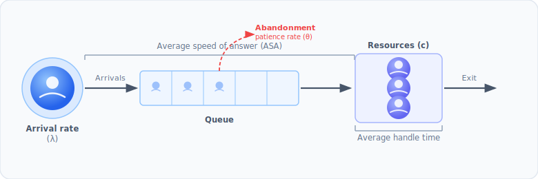

# Erlang A (abandonment)

Erlang C assumes customers wait forever. In real contact centers, people **hang
up** if they wait too long. The **Erlang A** model (the M/M/c+M queue) adds an
*abandonment* — or *patience* — rate: each waiting customer leaves after an
exponentially distributed patience time with mean `patience`.

Because some customers abandon, Erlang A typically needs **fewer** agents than
Erlang C for the same service level.

## How it is computed

pyworkforce computes every Erlang A metric **exactly** from the stationary
distribution of the underlying birth-death Markov chain — there are no
closed-form approximations. The chain has:

- birth rate $\lambda$ (arrival rate);
- death rate $\min(n, c)\,\mu + \max(n - c, 0)\,\theta$ in state $n$,

where $c$ is the number of servers, $\mu = 1/\text{AHT}$ the service rate and
$\theta = 1/\text{patience}$ the abandonment rate. Abandonment keeps the queue
finite, so the system is stable for **any** load.

::: tip Sanity check
As `patience` grows large (infinitely patient customers) the Erlang A metrics
converge to the Erlang C results. pyworkforce's test suite verifies this, and
also checks the analytic metrics against a Monte Carlo simulation.
:::

## The queue system



Callers who wait beyond their patience leave the queue (dashed red arrow).
The system remains stable at any load because abandonments prevent unlimited
queue growth.

## Basic usage

```python
from pyworkforce.queuing import ErlangA

erlang = ErlangA(transactions=100, aht=3, asa=20 / 60,
                 interval=30, patience=5, shrinkage=0.3)

print(erlang.required_positions(service_level=0.8,
                                max_occupancy=0.85,
                                max_abandonment=0.05))
```

```text
{'raw_positions': 13,
 'positions': 19,
 'service_level': 0.858...,
 'occupancy': 0.750...,
 'abandonment_probability': 0.025...,
 'waiting_probability': 0.226...,
 'average_speed_of_answer': 0.125...}
```

`required_positions` finds the smallest number of positions that meets **all**
of the targets you set: the service level, the maximum occupancy and the
maximum abandonment probability.

## Per-position metrics

For a fixed number of positions you can read each metric directly:

```python
erlang.waiting_probability(positions=14)       # P(delayed)
erlang.abandonment_probability(positions=14)   # P(customer abandons)
erlang.achieved_occupancy(positions=14)        # server utilization
erlang.average_speed_of_answer(positions=14)   # expected wait (minutes)
erlang.average_queue_length(positions=14)      # expected number waiting
erlang.service_level(positions=14)             # answered within asa
```

You can override the answer-time target per call:

```python
erlang.service_level(positions=14, asa=30 / 60)
```

## Parameters

| Parameter | Meaning |
| --- | --- |
| `transactions` | Arrivals in the interval |
| `aht` | Average handle time |
| `asa` | Target answer time (default service-level threshold) |
| `interval` | Interval length |
| `patience` | Mean time a customer waits before abandoning |
| `shrinkage` | Fraction of unavailable time, in `[0, 1)` |

`asa`, `aht`, `interval` and `patience` must share the same time unit.

## Erlang C vs Erlang A

| | Erlang C | Erlang A |
| --- | --- | --- |
| Customers abandon? | No | Yes |
| Tends to | over-staff | realistic staffing |
| Extra parameter | — | `patience` |
| Extra outputs | — | abandonment probability, queue length |

Use Erlang A when abandonment is material to your operation, and Erlang C as a
conservative baseline.
