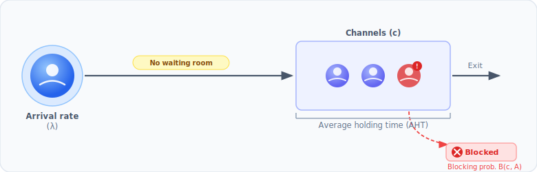

# Erlang B (loss systems)

In Erlang C and Erlang A, customers who arrive when all agents are busy
**wait in a queue**. In some systems there is **no waiting room at all**: if
every channel or trunk is occupied the call is rejected immediately and the
customer must try again later. The **Erlang B** model (the M/M/c/c queue)
describes these *pure-loss* systems.

## When to use Erlang B

| Use case | Why Erlang B fits |
| --- | --- |
| PSTN / SIP trunk sizing | Calls are blocked at the network, not queued |
| IVR / auto-attendant channel capacity | Channels are finite; no hold queue |
| Overflow link sizing in skill-based routing | Overflow is discarded, not retried internally |
| Any *blocked-calls-cleared* operation | Excess demand is shed, not absorbed |

If your system does queue callers, use [Erlang C](/guide/erlangc) (infinite
patience) or [Erlang A](/guide/erlanga) (finite patience) instead.

## The model



Erlang B (M/M/c/c) makes three assumptions:

- arrivals follow a **Poisson process**;
- each call occupies exactly one trunk / channel for an exponentially distributed
  holding time;
- there are exactly **c** channels and **no waiting room** — a call that finds
  all c channels busy is **blocked and lost**.

The blocking probability is computed via the numerically stable recursion:

$$B(0, A) = 1 \qquad B(n, A) = \frac{A \cdot B(n-1, A)}{n + A \cdot B(n-1, A)}$$

where $A = \text{transactions} / \text{interval} \times \text{AHT}$ is the
offered traffic in Erlangs.

Unlike Erlang C, the Erlang B system is **stable for any load** — excess traffic
is simply blocked rather than allowed to grow the queue.

## Basic usage

```python
from pyworkforce.queuing import ErlangB

erlang = ErlangB(transactions=100, aht=3, interval=30, shrinkage=0.3)

result = erlang.required_positions(max_blocking=0.02)
print(result)
```

```text
{'raw_positions': 17,
 'positions': 25,
 'blocking_probability': 0.0183...,
 'occupancy': 0.937...}
```

::: tip Units
`aht` and `interval` must use the **same time unit** (both minutes in the
example above).
:::

### What the result means

- **`raw_positions`** — the minimum number of productive channels needed to stay
  within the `max_blocking` target.
- **`positions`** — channels after accounting for shrinkage:
  `ceil(raw_positions / (1 − shrinkage))`.
- **`blocking_probability`** — the achieved blocking probability at `raw_positions`.
- **`occupancy`** — expected fraction of busy channels (carried traffic / channels).

### Adding an occupancy cap

Pass `max_occupancy` to reject solutions where servers are overloaded even
if the blocking target is met:

```python
result = erlang.required_positions(max_blocking=0.02, max_occupancy=0.85)
```

## Evaluating a fixed number of channels

You can also assess performance for a known number of channels rather than
sizing from scratch:

```python
erlang.blocking_probability(positions=20)   # probability a call is blocked
erlang.achieved_occupancy(positions=20)     # server utilisation
```

If your `positions` figure already includes shrinkage, pass
`scale_positions=True`:

```python
erlang.blocking_probability(positions=25, scale_positions=True)
```

## Parameters

| Parameter | Meaning |
| --- | --- |
| `transactions` | Calls (or tasks) arriving in the interval |
| `aht` | Average holding time per call |
| `interval` | Interval length (same unit as `aht`) |
| `shrinkage` | Fraction of unavailable time, in `[0, 1)` |

`ErlangB` does **not** take an `asa` parameter because there is no waiting in
this model.

## Running many scenarios with MultiErlangB

`MultiErlangB` sweeps a parameter grid in parallel, exactly like
[`MultiErlangC`](/guide/multierlang):

```python
from pyworkforce.queuing import MultiErlangB
from pyworkforce.utils import results_to_dataframe

param_grid = {
    "transactions": [80, 100, 120],
    "aht": [3],
    "interval": [30],
    "shrinkage": [0.0],
}
multi = MultiErlangB(param_grid=param_grid, n_jobs=-1)

scenarios = {"max_blocking": [0.01, 0.02]}
results = multi.required_positions(scenarios)

df = results_to_dataframe(results, multi.required_positions_params)
print(df[["transactions", "max_blocking", "raw_positions", "blocking_probability"]].to_string(index=False))
```

```text
 transactions  max_blocking  raw_positions  blocking_probability
           80          0.01             14              0.0098...
           80          0.02             13              0.0190...
          100          0.01             17              0.0095...
          100          0.02             17              0.0095...
          120          0.01             20              0.0099...
          120          0.02             19              0.0191...
```

## Erlang B vs Erlang C vs Erlang A

| | Erlang B | Erlang C | Erlang A |
| --- | --- | --- | --- |
| Waiting room? | **No** — blocked calls are lost | Yes — infinite queue | Yes — finite patience |
| Stable at any load? | Yes | No (`c > A` required) | Yes |
| Key metric | blocking probability | service level | service level + abandonment |
| Typical use | trunks, channels | call center headcount | call center headcount |
