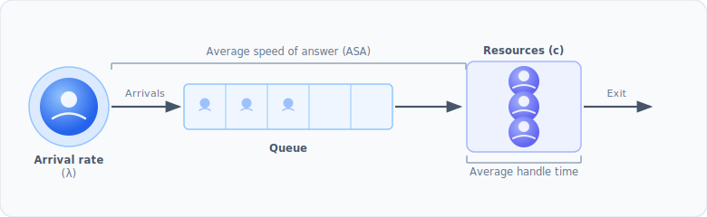

# Erlang C

Finding the number of positions (agents, tellers, operators, …) needed in a
queue is a classic planning problem. The **Erlang C** model is the most common
starting point.

## The queue system

Erlang C represents the system as a queue with these assumptions:

- arrivals follow a **Poisson process** with a constant rate;
- each resource handles **one transaction at a time**;
- there is a fixed number of positions available in the interval;
- when all positions are busy, transactions **wait in an infinite queue**;
- handling times follow an **exponential distribution**;
- there is **no abandonment** — nobody leaves the queue.



## Key terms

| Term | Meaning |
| --- | --- |
| **Transactions** | Number of incoming requests in the interval |
| **Arrival rate** | Transactions per unit of time |
| **AHT** | Average handle time — time a resource spends on one transaction |
| **ASA** | Average speed of answer — target waiting time before handling starts |
| **Shrinkage** | Fraction of time a resource is unavailable (breaks, training, …) |
| **Occupancy** | Fraction of time a resource is actually handling transactions |
| **Service level** | Fraction of transactions answered within the ASA target |

The **traffic intensity** (offered load, in Erlangs) is

$$ A = \frac{\text{transactions}}{\text{interval}} \times \text{AHT} $$

and is available as the `intensity` attribute.

## Basic usage

```python
from pyworkforce.queuing import ErlangC

erlang = ErlangC(transactions=100, asa=20 / 60, aht=3, interval=30, shrinkage=0.3)

requirements = erlang.required_positions(service_level=0.8, max_occupancy=0.85)
```

```text
{'raw_positions': 14,
 'positions': 20,
 'service_level': 0.8883500191794669,
 'occupancy': 0.7142857142857143,
 'waiting_probability': 0.1741319335950498}
```

::: tip Units
`asa`, `aht` and `interval` must all use the **same time unit**. In the example
above everything is in minutes, so a 20-second ASA target is `20 / 60`.
:::

### What the result means

- **`raw_positions`** — productive positions required before shrinkage.
- **`positions`** — positions to staff after accounting for shrinkage,
  `ceil(raw_positions / (1 - shrinkage))`.
- **`service_level`** — the achieved service level at `raw_positions`.
- **`occupancy`** — achieved occupancy, capped by `max_occupancy`.
- **`waiting_probability`** — probability an arriving transaction waits.

## Evaluating a fixed number of positions

Besides sizing the team, you can evaluate metrics for a given number of
positions:

```python
erlang.waiting_probability(positions=20)   # P(wait)
erlang.service_level(positions=20)         # achieved service level
erlang.achieved_occupancy(positions=20)    # occupancy
```

If your `positions` figure already includes shrinkage, pass
`scale_positions=True` so the productive positions are derived from it:

```python
erlang.service_level(positions=20, scale_positions=True)
```

## Inspecting the estimator

Like a scikit-learn estimator, `ErlangC` has a readable `repr` and
`get_params()`:

```python
>>> erlang
ErlangC(transactions=100, aht=3, asa=0.333..., interval=30, shrinkage=0.3)
>>> erlang.get_params()
{'transactions': 100, 'aht': 3, 'asa': 0.333..., 'interval': 30, 'shrinkage': 0.3}
```

## When Erlang C is not enough

Erlang C assumes nobody ever hangs up, which makes it **conservative**: it
tends to over-staff because, in reality, some customers abandon the queue. If
abandonment matters for your operation, use the
[Erlang A model](/guide/erlanga).
