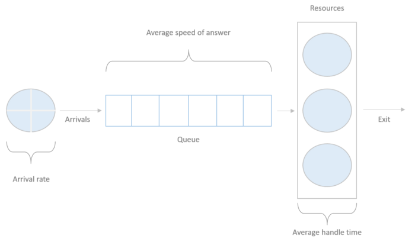

.. _erlangc:

Understanding ErlangC for Queue Problems
========================================

Introduction
------------

Finding the number of positions to use in a queue system has been a study case for a long time now;
it has applications in several fields and industries, for example, finding the optimal number of call centers agents,
deciding the number of bankers in a support station, network traffic analysis and so on.

There are several methods to analyze this problem;
this article will look at how to model it using the ErlangC approach.

Queue System
------------

In the most fundamental Erlang C method, we represent the system as a queue with the following assumptions:

* There is incoming traffic with a constant rate; the arrivals follow a Poisson process
* There is a fixed capacity in the system; usually, only one transaction gets handled by a resource at the time
* There is a fixed number of available positions in a time interval
* When all the positions have a total capacity, there is an infinite queue length
  where the requests wait for a position to be free.
* An exponential distribution describes the holding times in the queue
* There is no dropout from the queue.

A queue system with these characteristics may look like this:

In this representation, we can see several measures that will help us to describe the system;
here there are their definitions and how we are going to call them from now on:

* **Transactions:** Number of incoming requests
* **Resource:** The element that handles a transaction
* **Arrival rate:** The number of incoming transactions in a time interval
* **Average speed of answer (ASA):** Average time that a transaction waits in the queue to be attended by a resource
* **Average handle time (AHT):** Average time that takes to a single resource to attend a transaction

Other variables are in the diagram, but that is important for the model, those are:

* **Shrinkage:** Expected percentage of time that a server is not available, for example,
  due to breaks, scheduled training, etc.
* **Occupancy:** Percentage of time that a resource is handling a transaction
* **Service level:** Percentage of transactions that arrives at a resource before a target ASA

The way as Erlang C find the number of resources in this system is by finding the probability
that a transaction waits in queue, opposed to immediately being attended, it takes a target ASA
and service level and uses the others variables as the system parameters, if you want to know more about the details of
Erlang formulation, you can red the definition `here <https://en.wikipedia.org/wiki/Erlang_(unit)>`_

In the following article, we'll explain how to use pyworkforce to solve this kind of problem.