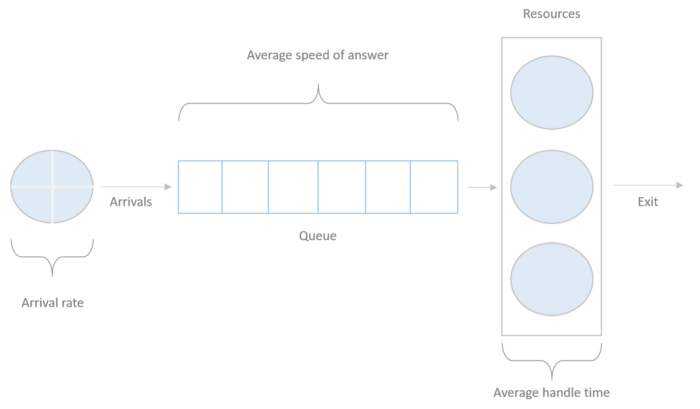

.. _erlangc:

Understanding ErlangC for Queue Problems
========================================

Introduction
------------

Finding the number of positions to use in a queue system is a long-standing planning problem.
It appears in many industries, for example when estimating the number of call center agents,
bank tellers, support staff, or network resources required to meet a service target.

There are several ways to analyze this problem. This article introduces the Erlang C approach
used by pyworkforce.

Queue System
------------

In the most fundamental Erlang C method, we represent the system as a queue with the following assumptions:

* Incoming traffic has a constant rate, and arrivals follow a Poisson process.
* The system has fixed capacity; usually, each resource handles one transaction at a time.
* There is a fixed number of available positions in a time interval
* When all positions are busy, requests wait in an infinite queue until a position is free.
* An exponential distribution describes the handling times.
* There is no dropout from the queue.

A queue system with these characteristics may look like this:

The diagram includes several measures used throughout pyworkforce:

* **Transactions:** Number of incoming requests
* **Resource:** The element that handles a transaction
* **Arrival rate:** The number of incoming transactions in a time interval
* **Average speed of answer (ASA):** Average time that a transaction waits before a resource starts handling it
* **Average handle time (AHT):** Average time that a resource spends handling one transaction

The model also uses these service-planning variables:

* **Shrinkage:** Expected percentage of time that a server is not available, for example,
  due to breaks, scheduled training, etc.
* **Occupancy:** Percentage of time that a resource is handling a transaction
* **Service level:** Percentage of transactions handled before the target ASA

For direct calls to the Erlang C performance methods, the number of productive positions must be greater than
the traffic intensity. This keeps the modeled queue system stable. If shrinkage scaling is enabled, productive
positions are computed after applying shrinkage.

Erlang C estimates the probability that a transaction waits in queue instead of being handled immediately.
pyworkforce uses that probability, together with the target ASA and service level, to search for the minimum
number of positions required by the system. For more background on Erlang formulas, see the
`Erlang unit definition <https://en.wikipedia.org/wiki/Erlang_(unit)>`_.

The next article shows how to solve this type of problem with pyworkforce.
